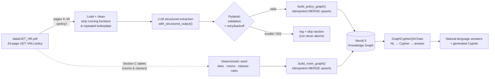
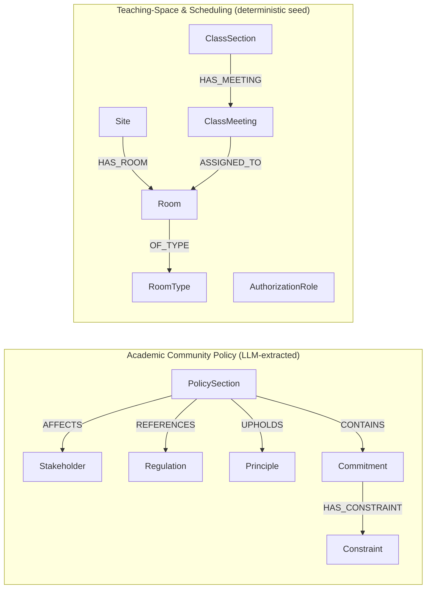

# University Policy GraphRAG

> A schema-first **GraphRAG** system that turns a university *Human Rights & Academic Community Policy*
> into a queryable **Neo4j** knowledge graph, then answers natural-language questions over it by generating Cypher.

This repository is the `GraphRAG Implementation` assignment for the **AI Study Roadmap · RAG Optimization** course.
It demonstrates entity/relationship extraction with LLM structured output, idempotent graph construction,
relationship-aware retrieval, and a natural-language → Cypher QA pipeline — including questions that are
**difficult or impossible to answer with vector search alone**.

---

## Table of contents

- [Why a graph?](#why-a-graph)
- [Source document](#source-document)
- [Architecture](#architecture)
- [Knowledge-graph schema](#knowledge-graph-schema)
- [Domain model](#domain-model)
- [Tech stack](#tech-stack)
- [Project structure](#project-structure)
- [Getting started](#getting-started)
- [Running the pipeline](#running-the-pipeline)
- [Sample Cypher queries & results](#sample-cypher-queries--results)
- [QA test set](#qa-test-set)
- [Design decisions](#design-decisions)
- [Assignment mapping](#assignment-mapping)
- [Troubleshooting](#troubleshooting)
- [Disclaimer](#disclaimer)

---

## Why a graph?

Vector search retrieves *similar text*. A knowledge graph retrieves *connected facts*. The policy is full of
questions whose answers live in the **relationships** between entities, not in any single paragraph:

- *"Which policy sections that uphold the **integrity** principle affect **students**?"*
- *"Which **confirmed classes** are assigned to **restricted** or **maintenance** rooms?"*
- *"How many **commitments** touch each **stakeholder** across the whole document?"*
- *"What is the total **seating capacity** of each **teaching site**?"*

Answering these requires traversing `PolicySection → Commitment`, `ClassSection → ClassMeeting → Room → Site`,
and aggregating across shared `Stakeholder` / `Room` nodes — exactly what a graph database is for.

---

## Source document

`data/UET_HR.pdf` — a 43-page university *extended reference framework* covering two distinct parts, **both** modeled here:

| Part | Pages | Content | How it is loaded |
|------|-------|---------|------------------|
| **A. Academic Community Policy** | 4–34 | Sections 1–29 + Annex A (case scenarios) + Annex B (RACI checklist) | LLM structured extraction |
| **B. Teaching-Space & Scheduling** | 35–42 | Section C: sites, rooms, room types, class sections, class meetings, authorization roles | Deterministic seed |

> The PDF is a **generated reference draft** for demonstration and policy-design use — not an officially issued
> university regulation. See the [Disclaimer](#disclaimer).

---

## Architecture



Two ingestion paths feed one graph: an **LLM extraction path** for the narrative policy text, and a
**deterministic seed path** for the structured room/scheduling tables (where parsing beats hallucination-prone
extraction). Both write with `MERGE`, so re-runs are idempotent.

---

## Knowledge-graph schema



---

## Domain model

### A. Academic Community Policy

| Entity | Key properties | Meaning |
|--------|----------------|---------|
| `PolicySection` | `section_number`, `title`, `subtitle`, `summary`, `control_objective` | One numbered section / annex |
| `Stakeholder` | `name`, `category` | A party affected or responsible. `category` ∈ student · academic_staff · research_staff · professional_staff · governance · external · other |
| `Regulation` | `name`, `authority` | A referenced law/rule/standard. `authority` ∈ vietnamese_law · vnu · uet · academic · other |
| `Principle` | `name` | A core value upheld (dignity, fairness, integrity, safety, privacy, accessibility, …) |
| `Commitment` | `description`, `modality`, `measurable` | An expectation/obligation. `modality` ∈ must · should · may · recommended |
| `Constraint` | `metric`, `value`, `unit`, `period` | A measurable bound (rare — the draft avoids invented numbers) |

### B. Teaching-Space & Scheduling

| Entity | Key properties | Meaning |
|--------|----------------|---------|
| `Site` | `code`, `name` | Teaching location: `GD3` (Giảng đường 3), `KM` (Kiều Mai), `HL` (Hòa Lạc) |
| `Room` | `room_code`, `site_code`, `capacity`, `status`, `accessible`, `has_projector`, `equipment` | Canonical teaching space. `status` ∈ ACTIVE · INACTIVE · MAINTENANCE · RESTRICTED · ARCHIVED |
| `RoomType` | `code`, `label` | LECTURE · SEMINAR · COMPUTER_LAB · ELECTRONICS_LAB · ROBOTICS_LAB · PROJECT · MEETING |
| `ClassSection` | `class_code`, `course_title`, `term_code`, `expected_size`, `delivery_mode`, `class_status` | One teaching instance of a subject |
| `ClassMeeting` | `meeting_id`, `day_of_week`, `start_time`, `end_time`, `meeting_type`, `status` | A scheduled assignment of a section to a room |
| `AuthorizationRole` | `name`, `capability` | Viewer · Scheduler · Facility administrator · System administrator |

---

## Tech stack

- **Python 3.11+**, managed with [`uv`](https://github.com/astral-sh/uv)
- **LangChain 1.x** — `ChatOpenAI`, `with_structured_output`, `GraphCypherQAChain`
- **Neo4j 5** (`langchain-neo4j`) — knowledge-graph store
- **Pydantic v2** — strict extraction contract
- **pypdf** — PDF loading
- **Docker** — local Neo4j
- **LLM** — any OpenAI-compatible gateway; defaults to the `nexai` auto-routing slug

---

## Project structure

```
.
├── task1_schema.py        # Pydantic domain models (policy + scheduling) — Task 1
├── task2_extraction.py    # PDF load/clean + LLM structured extraction — Task 2
├── task3_graph.py         # Neo4j builders (policy + room seed) + Cypher helpers — Task 3
├── task4_query.py         # GraphCypherQAChain NL→Cypher QA + 12-query test set — Task 4
├── run_pipeline.py        # One-command end-to-end build orchestrator
├── data/UET_HR.pdf        # Source document (43 pages)
├── pyproject.toml         # Dependencies (uv)
├── .env.example           # Environment template (copy to .env)
└── README.md
```

---

## Getting started

### 1. Prerequisites

- Python 3.11+ and [`uv`](https://github.com/astral-sh/uv)
- Docker (for Neo4j)
- An OpenAI-compatible LLM API key

### 2. Install dependencies

```bash
uv sync
```

### 3. Configure environment

```bash
cp .env.example .env
# then edit .env and set API_KEY_2 / BASE_URL_2 / LLM_MODEL
```

`.env` keys:

| Variable | Example | Purpose |
|----------|---------|---------|
| `FILE_PATH` | `data/UET_HR.pdf` | Source document |
| `API_KEY_2` | `sk-...` | LLM API key |
| `BASE_URL_2` | `https://getnexai.net/api/v1` | OpenAI-compatible base URL |
| `LLM_MODEL` | `nexai` | Model slug (must support structured output) |
| `NEO4J_URI` | `bolt://localhost:7687` | Neo4j Bolt endpoint |
| `NEO4J_USERNAME` | `neo4j` | Neo4j user |
| `NEO4J_PASSWORD` | `password` | Neo4j password |

### 4. Start Neo4j

```bash
docker run -d --name uet-neo4j \
  -p 7474:7474 -p 7687:7687 \
  -e NEO4J_AUTH=neo4j/password \
  -e NEO4J_PLUGINS='["apoc"]' \
  neo4j:5
```

Neo4j Browser: <http://localhost:7474> (login `neo4j` / `password`). Wait ~30s for Bolt to come up.

---

## Running the pipeline

### Build the graph (extraction + seed)

```bash
uv run python run_pipeline.py
```

This clears any previous graph, extracts the policy sections with the LLM, seeds the room/scheduling
sub-graph, and prints a build report. A typical report:

```text
=== BUILD REPORT ===
Policy extraction : {'sections': 31, 'stakeholders': ..., 'regulations': ..., 'principles': ..., 'commitments': ..., 'constraints': ...}
Room/scheduling   : {'sites': 3, 'room_types': 7, 'rooms': 24, 'class_sections': 15, 'class_meetings': 15, 'roles': 4}
Neo4j node counts :
   Room                 24
   ClassSection         15
   ClassMeeting         15
   PolicySection        31
   Commitment           ...
   Stakeholder          ...
   ...
```

> Extraction is **resilient**: each section is isolated, transient provider errors (HTTP 502) are retried with
> backoff, and a section that ultimately fails is logged and skipped — the run never aborts and the graph still
> builds from everything that succeeded.

### Query the graph (natural language)

```bash
uv run python task4_query.py
```

### Run the modules individually

```bash
uv run python task2_extraction.py   # extraction only (prints stats)
uv run python task3_graph.py        # seed the room/scheduling sub-graph only
```

---

## Sample Cypher queries & results

Reusable helpers live in `task3_graph.py`. Real results from the seeded scheduling sub-graph:

**Rooms per site** (`rooms_by_site`):

```cypher
MATCH (st:Site)-[:HAS_ROOM]->(rm:Room)
RETURN st.code AS Site, st.name AS Name, count(rm) AS Rooms, sum(rm.capacity) AS TotalCapacity
ORDER BY TotalCapacity DESC
```

| Site | Name | Rooms | TotalCapacity |
|------|------|-------|---------------|
| HL | Hòa Lạc campus | 10 | 540 |
| GD3 | Giảng đường 3 | 8 | 460 |
| KM | Kiều Mai teaching area | 6 | 306 |

**Confirmed classes in restricted/maintenance rooms** (`classes_in_unavailable_rooms`) — a multi-hop traversal
vector search cannot express:

```cypher
MATCH (cs:ClassSection)-[:HAS_MEETING]->(cm:ClassMeeting {status:'CONFIRMED'})-[:ASSIGNED_TO]->(rm:Room)
WHERE rm.status IN ['RESTRICTED','MAINTENANCE']
RETURN cs.class_code AS Class, cs.course_title AS Course, rm.room_code AS Room, rm.status AS RoomStatus
```

| Class | Course | Room | RoomStatus |
|-------|--------|------|------------|
| EMB-01 | Embedded Systems Practice | KM-301 | RESTRICTED |
| ROB-01 | Robotics Laboratory | HL-B201 | RESTRICTED |

**Capacity conflicts** (`capacity_conflicts`) — confirms `expected_size ≤ room.capacity` for every confirmed
in-person meeting (the seed registry is internally consistent, so this returns no rows):

```cypher
MATCH (cs:ClassSection)-[:HAS_MEETING]->(cm:ClassMeeting {status:'CONFIRMED'})-[:ASSIGNED_TO]->(rm:Room)
WHERE cs.expected_size > rm.capacity
RETURN cs.class_code, cs.expected_size, rm.room_code, rm.capacity
```

---

## QA test set

`task4_query.py` validates the natural-language → Cypher pipeline on **12 queries** across the three required
patterns and both sub-graphs:

| # | Pattern | Question |
|---|---------|----------|
| 1 | Entity lookup | Titles of all policy sections |
| 2 | Entity lookup | All distinct stakeholders |
| 3 | Entity lookup | External regulations / handbooks referenced |
| 4 | Entity lookup | Core principles upheld |
| 5 | Entity lookup | Teaching sites and room counts |
| 6 | Relationship traversal | Policy sections that affect Students |
| 7 | Relationship traversal | Confirmed classes in restricted/maintenance rooms |
| 8 | Relationship traversal | Class sections in robotics/electronics labs |
| 9 | Relationship traversal | Commitments in “Student Rights and Responsibilities” |
| 10 | Aggregation | Commitments associated with Students |
| 11 | Aggregation | Total seating capacity per site |
| 12 | Aggregation | Rooms per operational status |

The Cypher-generation prompt is **schema-constrained** and seeded with UET-specific few-shot examples, and
explicitly forbids inventing labels (`Document`, `Employee`, `Course`, …) — a common failure mode of text-to-Cypher.

---

## Design decisions

- **Schema-first extraction.** The LLM output is bound to a Pydantic model via `with_structured_output`, so every
  record is validated against a strict contract *before* it touches Neo4j. Bad responses are caught as
  `ValidationError`, not as silent graph corruption.
- **Two ingestion paths.** Narrative policy text is LLM-extracted; the structured room/class tables are seeded
  deterministically. Parsing tabular reference data directly is more reliable than asking an LLM to transcribe it.
- **Idempotent writes.** Every node/relationship uses `MERGE` keyed on a natural identifier (`title`, `name`,
  `room_code`, `class_code`, …), so re-running the pipeline never duplicates data. Shared nodes (a `Stakeholder`,
  a `Room`) become the join points that make multi-section / multi-class queries possible.
- **`Principle` as a first-class node.** Core values (integrity, fairness, privacy, safety…) are modeled as nodes
  rather than text, enabling cross-section aggregation by theme.
- **Resilience over perfection.** Per-section isolation + retry/backoff means a flaky gateway degrades coverage
  gracefully instead of failing the whole build.
- **Separation of build vs. query.** `run_pipeline.py` builds; `task4_query.py` queries. This keeps the expensive
  extraction step independent of the interactive QA step.

---

## Assignment mapping

| Assignment task | Where | What |
|-----------------|-------|------|
| **Task 1** — Domain schema (≥4 entity types, relationships, constraints) | `task1_schema.py` | 6 policy entities + 6 scheduling entities, enums, measurable constraints |
| **Task 2** — Extraction pipeline (load, chunk, structured output, error handling, stats) | `task2_extraction.py` | Page-filtered load, clean, LLM structured output, validation, retry, statistics |
| **Task 3** — Build knowledge graph (nodes, relationships, MERGE, graph queries) | `task3_graph.py` | Idempotent builders for both sub-graphs + 10 reusable Cypher helpers |
| **Task 4** — GraphRAG query pipeline (NL→Cypher, validation, 10-query test set) | `task4_query.py` | `GraphCypherQAChain`, schema-constrained few-shot prompt, 12-query test set |

---

## Troubleshooting

| Symptom | Cause | Fix |
|---------|-------|-----|
| `502 Upstream unavailable` | The public LLM gateway is rate-limiting / degraded | The pipeline already retries with backoff; re-run to top up coverage, or point `BASE_URL_2`/`LLM_MODEL` at another OpenAI-compatible provider |
| `Connection refused` on Bolt | Neo4j not up yet | Wait ~30s after `docker run`; check `docker ps` and <http://localhost:7474> |
| Empty answers / wrong Cypher | Model invented a label | Tighten `CYPHER_GENERATION_TEMPLATE` few-shot examples in `task4_query.py` |
| `ValidationError` on a section | Provider returned off-schema JSON | Logged and skipped automatically; usually transient — re-run |

---

## Disclaimer

`data/UET_HR.pdf` is a **generated reference draft** prepared for demonstration, discussion and policy-design
purposes. It is **not** an officially issued UET regulation, a legal opinion, or a substitute for applicable
Vietnamese law, Vietnam National University regulations, or formally approved UET procedures. The room codes,
capacities and class records in Section C are **illustrative sample data** for system design and testing, not
official UET inventory. Where an official regulation differs, the official regulation prevails.
